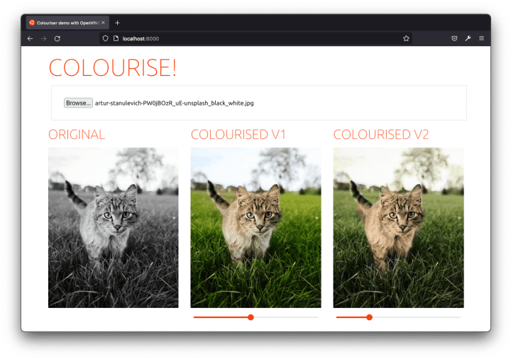
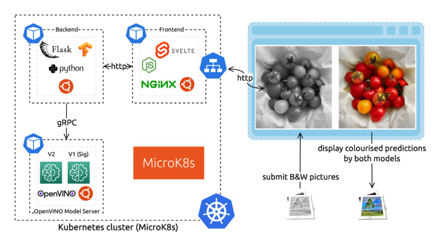
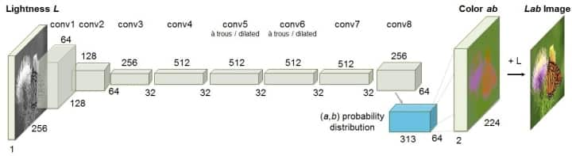
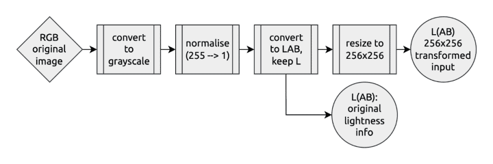
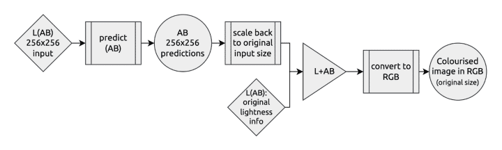
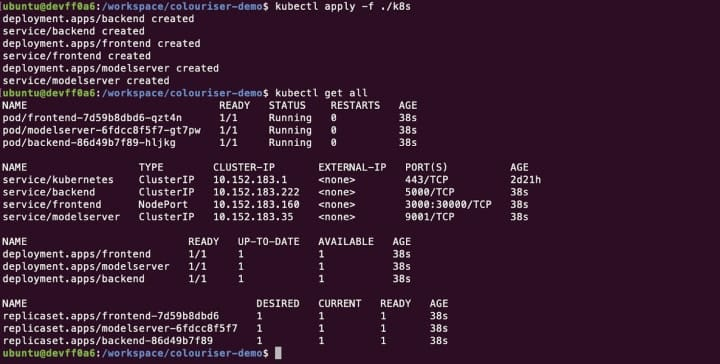
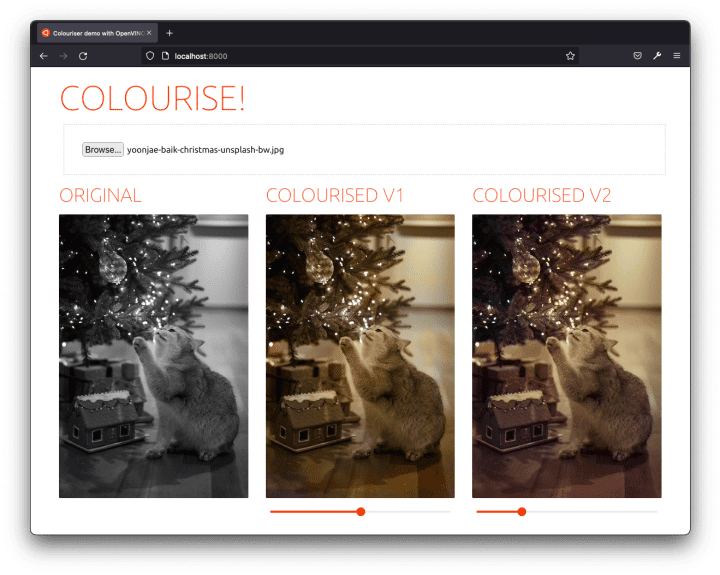

_If you’re looking to bring a stack of old family photos back to life, check out Ubuntu’s demo on how to use OpenVINO on Ubuntu containers to colorize monochrome pictures. This magical use of containers, neural networks, and Kubernetes is packed with helpful resources and a fun way to dive into deep learning!_

_A version of_ [_Part 1_](https://ubuntu.com/blog/how-to-colourise-black-white-pictures-openvino-containers-part-1) _and_ [_Part 2_](https://ubuntu.com/blog/how-to-colourise-black-white-pictures-openvino-containers-part-2) _of this article was first published on Ubuntu’s blog._


## A few words about OpenVINO on Ubuntu containers

Docker image security isn’t only about [provenance and supply chains;](https://ubuntu.com/blog/secure-containers-supply-chain-intel-openvino-canonical) it’s also about the user experience. More specifically, the developer experience.

As the most popular container image in its category, the Ubuntu [base image](https://gallery.ecr.aws/lts/ubuntu) provides a seamless, easy-to-set-up experience. From public cloud hosts to IoT devices, the Ubuntu experience is consistent and loved by developers. In this blog, you’ll see that using Ubuntu Docker images greatly simplifies component containerization. We even used a [prebuilt & preconfigured container image](https://hub.docker.com/u/ubuntu) for NGINX.

When you’re ready to deploy deep learning inference in production, binary size and memory footprint are key considerations – especially when deploying at [the edge](http://ubuntu.com/edge-computing). OpenVINO provides a lightweight Inference Engine with a binary size [of just over 40MB](https://www.intel.com/content/www/us/en/artificial-intelligence/posts/openvino-reduce-app-footprint.html) for CPU-based inference. It also provides a Model Server for serving models at scale and managing deployments.

OpenVINO includes open-source developer tools to improve model inference performance. The first step is to convert a deep learning model (trained with TensorFlow, PyTorch,…) to an Intermediate Representation (IR) using the Model Optimizer. In fact, it cuts the model’s memory usage [in half](https://www.intel.com/content/www/us/en/developer/articles/technical/should-i-choose-fp16-or-fp32-for-my-deep-learning-model.html) by converting it from FP32 to FP16 precision.

Open Model Zoo provides pre-trained models that work for real-world use cases to get you started quickly. Additionally, Python and C++ sample codes demonstrate how to interact with the model. More than 280 pre-trained models are available to download, from speech recognition to natural language processing and computer vision.

For this blog, we will use the pre-trained colorization models from Open Model Zoo and serve them with Model Server.

## Demo architecture

**“As a user, I can drag and drop my old black and white pictures to my browser so that it displays their ready-to-download colorized version.” – said the PM (me).**

For that – replied the one-time software engineer (still me) – we only need:

-   A fancy yet lightweight frontend component.
-   OpenVINO™ Model Server to serve the neural network colorization predictions.
-   A very light backend component.



Whilst we could target the Model Server directly with the frontend (it exposes a REST API), we need to apply transformations to the submitted image. The colorization models, in fact, each expect a specific input.

Finally, we’ll deploy these three services with Kubernetes because … well … because it’s groovy. And if you think otherwise (everyone is allowed to have a flaw or two), you’ll find a fully functional docker-compose.yaml in the source code repository.

In the upcoming sections, we will first look at each component and then show how to deploy them with Kubernetes using MicroK8s. Don’t worry; the full source code is [freely available](https://github.com/valentincanonical/colouriser-demo), and I’ll link you to the relevant parts.

### gRPC vs REST APIs

The OpenVINO Model Server provides inference as a service endpoints for serving models in [OpenVINO IR](https://docs.openvino.ai/latest/openvino_docs_MO_DG_IR_and_opsets.html) or [ONNX](https://onnx.ai/) format. It also offers centralized model management to serve multiple different models or different versions of the same model and model pipelines.

The server offers two sets of APIs to interface with it: REST and gRPC. Both APIs are compatible with TensorFlow Serving and expose endpoints for prediction, checking model metadata, and monitoring model status. For use cases where low latency and high throughput are needed, you’ll probably want to interact with the model server via the gRPC API. Indeed, it introduces a significantly smaller overhead than REST. (Read [more about gRPC](https://grpc.io/about/).)

OpenVINO Model Server is distributed as a [Docker image](https://hub.docker.com/r/openvino/model_server) with minimal dependencies. For this demo, we will use the Model Server container image deployed to a MicroK8s cluster. This combination of lightweight technologies is suitable for small deployments such as a developer laptop or edge computing devices.

### Neural network – OpenVINO Model Server

The colorization neural network is [published under](https://github.com/richzhang/colorization) the BSD 2-clause License, accessible from the [Open Model Zoo](https://github.com/openvinotoolkit/open_model_zoo). It’s pre-trained, so we don’t _need_ to understand it in order to use it. However, let’s look closer to understand what input it expects. I also strongly encourage you to read the original work from Richard Zhang, Phillip Isola, and Alexei A. Efros. They made the approach super accessible and understandable on [this website](http://richzhang.github.io/colorization/) and in the original [paper](https://arxiv.org/abs/1603.08511).



As you can see on the network architecture diagram, the neural network uses an unusual color space: **LAB**. In fact, there are many 3-dimensional spaces to code colors: RGB, HSL, HSV, etc. The LAB format is relevant here as it fully isolates the color information from the lightness information. Therefore, a grayscale image can be coded with only the L (for Lightness) axis. We will thereore only send the L axis to the neural network’s input. It will generate predictions for the colors coded on the two remaining axes: A and B.

From the architecture diagram, we can also see that the model expects a 256×256 pixels input size. For these reasons, we cannot just send our RGB-coded grayscale picture in its original size to the network. We need to first transform it.

We compare the results of two different model versions for the demo. Let them be called ‘V1’ (Siggraph) and ‘V2’. The models are served with the same instance of the OpenVINO™ Model Server as two different models. (We could also have done it with two different versions of the same model – read more in [the documentation](https://github.com/openvinotoolkit/model_server/blob/main/docs/models_repository.md).)

Finally, to build [the Docker image](https://github.com/valentincanonical/colouriser-demo/blob/main/modelserver/Dockerfile), we use the first stage from the Ubuntu-based development kit to download and convert the model. We then rebase on the more lightweight Model Server image.

```Dockerfile
# Dockerfile: github.com/valentincanonical/colouriser-demo/blob/main/modelserver/Dockerfile

FROM openvino/ubuntu20_dev:latest AS omz

# download and convert the model
…

FROM openvino/model_server:latest

# copy the model files and configure the Model Server
…

```

### Backend – Ubuntu-based Flask app (Python)

For the backend microservice that interfaces between the user-facing frontend and the Model Server hosting the neural network, we chose to use Python. There are many valuable libraries to manipulate data, including images, specifically for machine learning applications. To provide web serving capabilities, [Flask](https://github.com/pallets/flask) is an easy choice.

The backend takes an HTTP POST request with the to-be-colorized picture. It synchronously returns the colorized result using the neural network predictions. In between – as we’ve just seen – it needs to convert the input to match the model architecture and to prepare the output to show a displayable result.

Here’s what the [transformation pipeline](https://github.com/valentincanonical/colouriser-demo/blob/main/backend/colorize.py#L65) looks like on the input:



And the output looks something like that:



To containerize our Python Flask application, we use the first stage with all the development dependencies to prepare our execution environment. We copy it onto a fresh Ubuntu base image to run it, configuring the model server’s gRPC connection.

### Frontend – Ubuntu-based NGINX container and Svelte app

Finally, I put together a fancy UI for you to try the solution out. It’s an effortless single-page application with a file input field. It can display side-by-side the results from the two different colorization models.

I used [Svelte](https://svelte.dev/) to build the demo as a dynamic frontend. Below each colorization result, there’s even a saturation slider (using a CSS transformation) so that you can emphasize the predicted colors and better compare the before and after.

To ship this frontend application, we again use a [Docker image](https://github.com/valentincanonical/colouriser-demo/blob/main/frontend/Dockerfile). We first build the application using the Node base image. We then rebase it on top of a preconfigured Ubuntu-based [NGINX image](https://hub.docker.com/r/ubuntu/nginx). A reverse proxy on the frontend side serves as a passthrough to the backend on the `/api` endpoint to simplify the deployment configuration. We do that directly in an [NGINX.conf configuration file](https://github.com/valentincanonical/colouriser-demo/blob/main/frontend/nginx.conf) copied to the NGINX templates directory. The container image is preconfigured to use these template files with environment variables.

## Deployment with Kubernetes

I hope you had the time to digitalize some of your old black and white pictures because things are about to get serious(ly colorized).

We’ll assume you already have a running Kubernetes installation from the next section. If not, I encourage you to [go through this MicroK8s tutorial](https://ubuntu.com/tutorials/install-a-local-kubernetes-with-microk8s).

### Build the components’ Docker images

Every component comes with a Dockerfile to build itself in a standard environment and ship its deployment dependencies (read [What are containers](https://ubuntu.com/containers/what-are-containers) for more information). They all create an Ubuntu-based Docker image for a consistent developer experience.

Before deploying our colorizer app with Kubernetes, we need to build and push the components’ images. They need to be hosted in a registry accessible from our Kubernetes cluster. We will use the [built-in local registry](https://microk8s.io/docs/registry-built-in) with MicroK8s. Depending on your network bandwidth, building and pushing the images will take a few minutes or more.

```sh
git clone https://github.com/valentincanonical/colouriser-demo.git
cd colouriser-demo

# Backend
docker build backend -t localhost:32000/backend:latest
docker push localhost:32000/backend:latest

# Model Server
docker build modelserver -t localhost:32000/modelserver:latest
docker push localhost:32000/modelserver:latest

# Frontend
docker build frontend -t localhost:32000/frontend:latest
docker push localhost:32000/frontend:latest
```

### Apply the Kubernetes configuration files

All the components are now ready for deployment. The Kubernetes configuration files are available as deployments and services YAML descriptors in [the ./K8s folder](https://github.com/valentincanonical/colouriser-demo/tree/main/k8s) of the demo repository. We can apply them all at once, in one command:

```sh
kubectl apply -f ./k8s
```

Give it a few minutes. You can watch the app being deployed with `watch kubectl status`. Of all the services, the frontend one has a specific `NodePort` configuration to make it publicly accessible by targeting the Node IP address.



Once ready, you can access the demo app at [http://localhost:30000/](http://localhost:30000/) (or replace `localhost` with a cluster node IP address if you’re using a remote cluster). Pick an image from your computer, and get it colorized!

## That’s a wrap!

All in all, the project was pretty easy considering the task we accomplished. Thanks to Ubuntu containers, building each component’s image with multi-stage builds was a consistent and straightforward experience. And thanks to OpenVINO™ and the Open Model Zoo, serving a pre-trained model with excellent inference performance was a simple task accessible to all developers.

Cherry on top, you didn’t even have to share your pics over the Internet to get it done!

