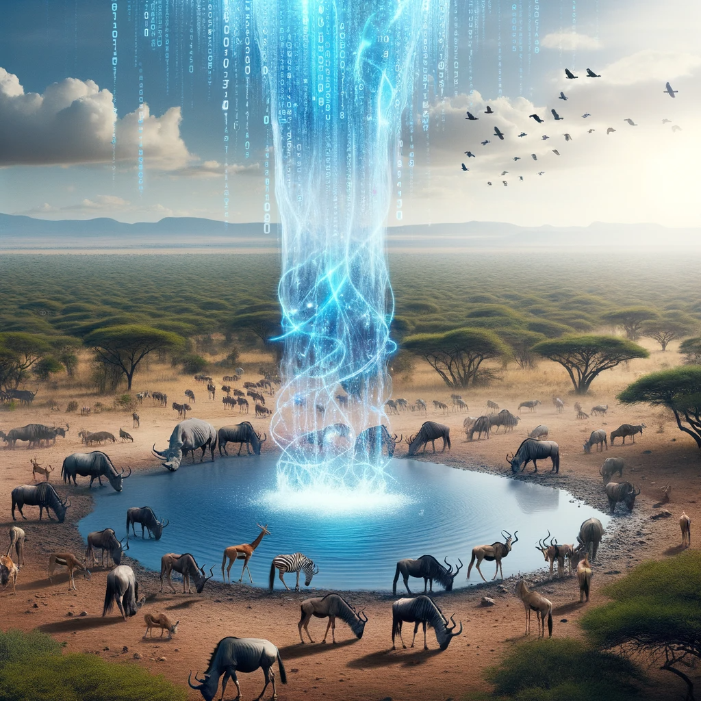
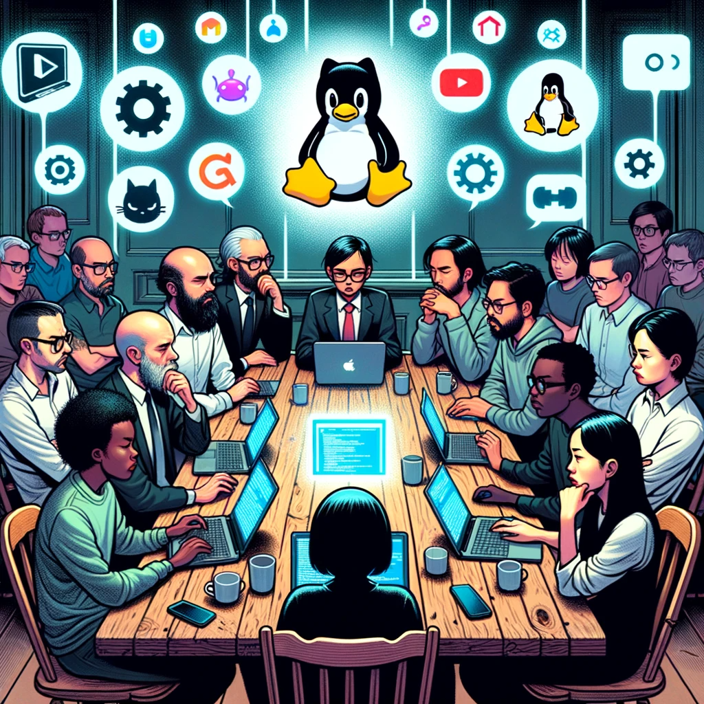
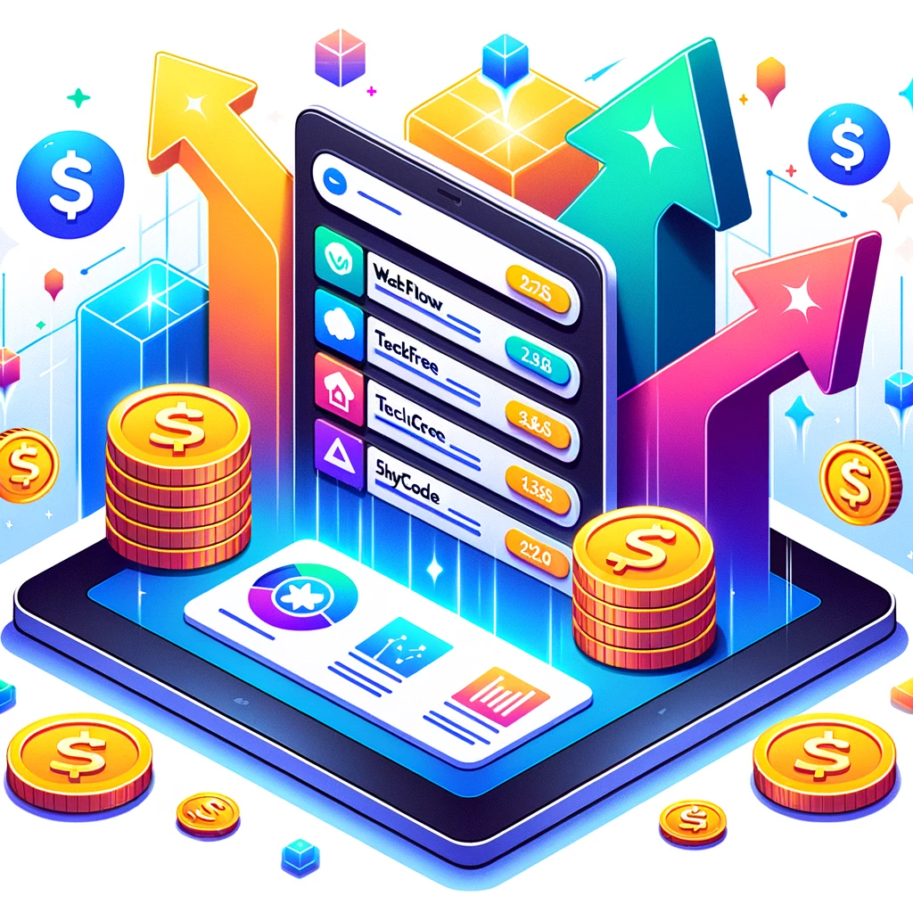
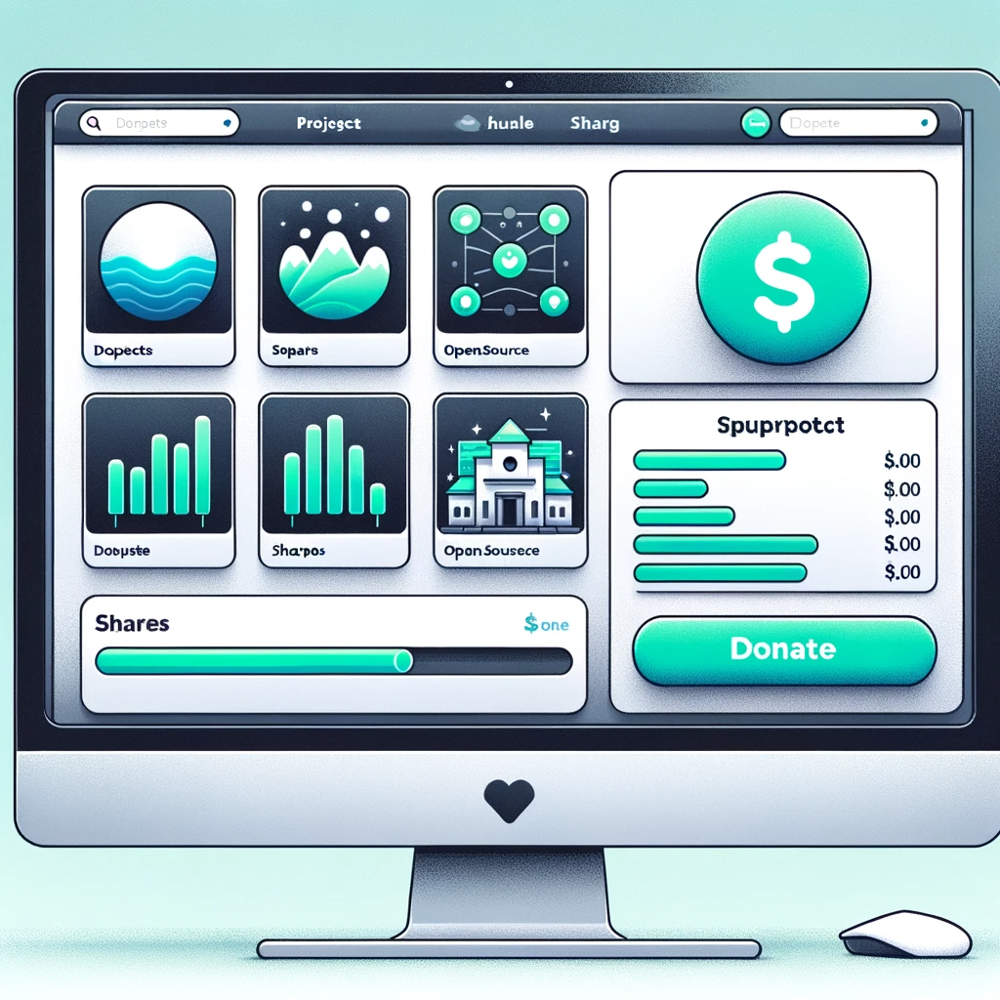

In my last post —[Why Open Source isn't Profitable](https://mindthegapblog.com/posts/why-open-source/)—, I explain the [Curse of Competition](https://mindthegapblog.com/posts/why-open-source/#the-curse-of-competition) as a sort of [Tragedy of the Commons](https://www.jstor.org/stable/1724745): because open-source intellectual property is free to access, all economic agents will exploit it without giving back (a.k.a. as the _free riders_ issue). If the resource is finite, then its value will tragically be destroyed by this unrestrained consumption.

With the same analysis, we can explain how and why our current dominant economic system will eventually consume all of the available natural resources and destroy all living species. That is, unless proper regulations were to be globally adopted ([Governing the Commons: The Evolution of Institutions for Collective Action](https://digitalrepository.unm.edu/cgi/viewcontent.cgi?article=1848&context=nrj), Elinor Ostrom, 1992).

## Two very different tragedies of the commons

To some extent, open source isn't exactly a typical Tragedy of the Commons. In the case of open source, the present resource isn't scarce nor finite. Once the intellectual property (knowledge) has been produced, its reproduction cost is zero. Therefore creating an abundance of the said free resource. There ends the analogy with Nature. ([Private copying, reproduction costs, and the supply of intellectual property](https://doi.org/10.1016/0167-6245(86)90012-0), Stanley M Besen, 1986)

Indeed, the key issue with growth economic models is that they rely on the abundance of a resource, which most often isn't the case. Especially when it comes to [natural resources](https://www.stockholmresilience.org/research/planetary-boundaries.html).

### Side-note: Free software is not a given

To some, it might seem that 'open source' (and its purest 'free software' form) is a given. In fact, it's everywhere and a lot of companies are contributing to open source. So what's the matter?

> I interchangeably use 'free software', 'libre software', and 'open source'. These are not always obvious synonyms. Many definitions exist. When I write my essays and notes, I consider 'free' software if it comes with a license granting **Access**, **Modification**, **Distribution** rights to **all**.
> Read more on: [opensource.org/licenses/](https://opensource.org/licenses/).

Many of our freedoms seem trivial today. We enjoy them without even realising they could be gone from one day to the other. But no freedom came without a fight.

The history of computing and the Internet is fascinating. The history of Free software even more (I encourage french-speakers to read "[Une histoire de l'informatique](https://books.google.fr/books?id=w1p1QgAACAAJ&hl=fr&source=gbs_ViewAPI&redir_esc=y)" by P. Breton).

Free software is an ideology. In the 80s, [Richard Stallman](https://en.wikipedia.org/wiki/Richard_Stallman) —father of the Copytheft's GPL licence, GNU project, and Free Software Foundation— shared the ideology [originating thoughts and philosophy](https://www.gnu.org/philosophy/fsfs/rms-essays.pdf). Simplistically: **software must be _free_ (as in freedom) because we humans aim to be _free_ and it was foreseen that eventually software would govern our human lives.**

In 1991, [Linus Torvalds](https://en.wikipedia.org/wiki/Linus_Torvalds) boosted the GNU project by creating Linux and Git. These free projects would soon become the foundation for the entire modern computing stack.

However, many times, corporations tried to destroy the free software movement.
"The free-software movement, espoused by the Free Software Foundation, which Mr. Stallman has led since 1984, is far more ideological than the open-source philosophy. Free-software proponents argue that users should be free to run, copy, distribute, study, change and improve the software they use. Mr. Stallman's detractors have accused him of being everything from a communist to a thief. [...] Microsoft senior vice president, Jim Allchin, accused the open-source movement of compromising the nation's intellectual property law." ([New York Times](https://www.nytimes.com/2001/06/04/business/new-economy-despite-microsoft-s-best-efforts-kill-it-free-software-movement.html), 2001).
"Microsoft executives were blunt, describing open source software as a 'short-term revenue and platform threat', and expressing concerns that the movement’s 'free idea exchange' would 'present a long term developer mindshare threat' [...] Microsoft subsequently used 'everything in their marketing arsenal to discredit open source software’s reliability', adopting familiar propagandistic rhetoric that described open source licenses using 'three of the most feared words in the United States: cancer, communism, and un-American'" ([Open (For Business): Big Tech, Concentrated Power, and the Political Economy of Open AI](https://papers.ssrn.com/sol3/papers.cfm?abstract_id=4543807), Wider, West, Whittaker, 2023).

It's worth noting that often _coincidentally_ (_sarcasm_), corporations loosing their market share would suddenly become strong defenders of the free software movement. In fact, they regularly subsidised or developed it further: such as IBM and Red Hat in 1999, Google with Android in 2008 and then Kubernetes in 2014, and again Meta with LLaMa2 in 2023.

In conclusion, the existence of free software today is due to 1/ ideologies from the 80s powered by highly-talented developers, 2/ tech corporations trying to maintain their monopolies.

Open source is a self-replicating winner: the more is free, the more will be free. As long as funding is being injected, open source is and will be a default. The cloud-native software space is, in my opinion, the best example of open source software powered by monopolies.

## Instant value

The value of open-source knowledge comes both from its past and its future, but not from its present state. Before: when the value is being created. And after: when the said resource's value might decrease or even go negative in case sufficient maintenance isn't provided (bugs, CVEs, malware etc). Its present state is free and infinite.

These are the two types of value that open source creates,

1. **Positive value**: delivering an innovative solution to an outstanding problem,
2. **Negative value**: requiring maintenance work in order to remain valuable.

Both types are ''**instant value**'' —comparable to power in an electricity market.

### Open source factories

Imagine if open source projects were knowledge factories and open source contributors were machines in these factories. Without power, these factories would be worth nothing. With power, with electricity, the machines can start functioning and delivering potential value.

Take two of these factories. Depending on the number of machines and their type, the instant power of the two factories might differ. One might require 10kW and the other 5kW to function. Let's assume we budget 10kWh of energy for each. The first factory will be able to function for an hour and the second for two hours.

After an hour, which of the two factories did deliver more value?
With an energy budget of 10kWh, which of the two factories did deliver more value?

Well, we don't know. In fact, it wouldn't matter if one absorbed 100kWh and the other 1kWh. The only thing that matters is their outcome and its value to society (or rather, to the market).

It approximatively requires [as much energy](https://www.techwalls.com/production-costs-of-smartphones/) to build an iPhone 13 Pro Max (2021) than a Google Pixel 6 Pro (2021). And yet, the iPhone is 30% more expensive. In fact, that's exactly how value is being defined in our economy.

Energy has a production cost and therefore is virtually limited. The selling price of the produced goods and services must be higher than its production cost, otherwise it wouldn't create value and the company would quickly crash on the market and possibly go bankrupt.

> Note that companies have 'innovation inertia'. They will often likely crash on the markets before going bankrupt. This will give them a last chance to innovate and turn the ship around.

**The current economy is designed to maximise the `price-cost=value` equation.**

In theory, this design should maximise the innovative value delivered by companies.

In practice, monopolies grew and tech companies now spend more energy [fighting](https://www.gnu.org/gnu/manifesto.en.html) than innovating. In fact, there's a significant [decrease in productivity](https://www.nber.org/system/files/working_papers/w25505/revisions/w25505.rev2.pdf) directly attributable to them.

## The open source tragedy

**The tragedy of open source is that it's a fantastic factory without electricity.**

Open source has no business model. It's not able to create added value as defined by our current economy and therefore not able to power itself. In other words: there's no investment loop (= [open source is not profitable](https://mindthegapblog.com/posts/why-open-source/)).

What is scarce is not open-source knowledge itself, as the created knowledge is abundant. What is scarce is the instant value of open source: the power of contributors. The maintainers. _They_ are the tragically endangered _Commons_. What if they [stopped working](https://www.theregister.com/2023/09/26/linux_kernel_report_2023/) or [being good](https://blog.sonatype.com/npm-libraries-colors-and-faker-sabotaged-in-protest-by-their-maintainer-what-to-do-now)?

Despite open source being **[the best](https://encyclopedia.pub/entry/25442) knowledge-innovation factory** at our disposal, very few are willing to power it. In fact, why should anyone pay for electricity if everyone else is going to benefit from the produced knowledge as well? There it is: the same tragic destiny that Mother Earth is facing.

And it gets worse ; if some people are willing to work for free, [why should we even pay them](https://www.ashedryden.com/blog/the-ethics-of-unpaid-labor-and-the-oss-community)?
I often heard that '_maybe_ they don't _want_ to get paid, _maybe_ paying them will _change_ them.'

-Breathe.-

**The economy should be here to serve humanity, not the opposite.**

If the current state of our economy is slowing down (or even, not speeding up) innovation, then our economy is broken (or, malfunctioning).

> A good starting point for learning about the Economy is Gilles Mitteau's book "[Tout sur l'économie](https://www.payot-rivages.fr/payot/livre/tout-sur-l%C3%A9conomie-ou-presque-9782228926133)" (unfortunately again another french-speakers-only recommendation)

## Markets as a tool in our belt

Financial markets are a powerful tool to incentivise value creation and the unstoppable race to innovation. We [successfully]([https://a16z.com/the-techno-optimist-manifesto/](https://a16z.com/the-techno-optimist-manifesto/)) used them to drive years of incredible technological progress.

**Unfortunately, the current version of our financial markets might well destroy humanity.**

Unless we successfully create the market incentives to invest back into the 'Commons'.

### Curation markets: New economies

About seven years go, [@simondlr](https://twitter.com/simondlr) started writing about [Curation Markets](https://medium.com/@simondlr/solving-price-discovery-of-non-rivalrous-goods-with-curved-bonding-27b2186d55d5). A new kind of financial instrument that would be able to create the incentives to [Save the Planet](https://medium.com/@simondlr/saving-the-planet-making-it-profitable-to-protect-the-commons-50393906fe22).

The principle is simple: tokenising a scarce resource and using a mathematical formula to dynamically incentivise more future investments. This results in a financial market with clear rules, ability to make a profit & influence the game, and potential value creation.

[DeSo](https://docs.deso.org/) adopted this principle to tokenise influencers' popularity on social networks and allow them to leverage it to fund their own content and the future of their influencer's 'Brand'.

The outcome is New Economies: Creator Economy, Gig Economy, Curation Economy, etc.

> Note that new economies are just tools as well. They aren't inherently good or bad (in fact, [nothing is](https://www.goodreads.com/quotes/21959-there-is-nothing-either-good-or-bad-but-thinking-makes)). However, arguably, the uncertainty of gigs and creators' revenues (vs waged work) is a problem. This is something that could be solved through regulations —such as implementing a [Universal Base Income](https://www.lemonde.fr/blog/piketty/2021/05/18/from-basic-income-to-inheritance-for-all/)— or worker collectives, cooperatives, that could solve this problem with socialising the risks with an 'insurance' risk-smoothing model.

Creating new economies is hard, especially within the current global economy. The new economy must first validate two key hypotheses: **value creation** and **growth**. In addition, economies are subject to **network effects** and require '**fuel**' (= money) to power them. 

This isn't much different to creating a new venture. In fact, Uber, AirBnB and many others are platform-type ventures that successfully created [new economies](https://www.vox.com/new-money/2017/3/6/14563112/sharing-economy-not-a-thing). It's just much harder.

## Investing in open source's future

The same thing can be done with open source: Incentivising investors and consumers to pay for the _electricity_ that powers the open source _factories_.

### Value creation hypothesis

In fact, some corporations and public entities are already paying to maintain and develop specific, popular open-source projects. They are subsidising their instant value creation. And the most successful open-source projects even are able to sell extra services on top (Related read: "Investing in Open Source: The FOSS Contributor Fund", Duane O’Brien and Mandy Grover, Indeed, 2022).

This is the value creation hypothesis: **the instant value delivered by open-source projects is valuable to other economic agents with strong economic motives to subsidise it.**

It might be new projects that will give them a competitive market edge over their proprietary competitors, or maintaining older projects that they use or will use as critical dependencies.

In an EU commission-requested report, the Fraunhofer institute concluded that for every additional 1€ injected in subsidising open source, close to 800€ would be created in the global European economy as an increase of the bloc's GDP ([Study about the impact of open source software and hardware on technological independence, competitiveness and innovation in the EU economy](https://digital-strategy.ec.europa.eu/en/library/study-about-impact-open-source-software-and-hardware-technological-independence-competitiveness-and), Fraunhofer, 2021).

The instant value is a 'Common' ; but, together, the economic agents realise that they might financially benefit from subsidising it successfully.

### Growth hypothesis

Wait, but why aren't big corporations forking free projects and maintaining their own versions? Because the sum is greater than its parts. Forking Ubuntu sure gives you a fully-working Linux Distribution... but it's not "Ubuntu" anymore. It isn't able to attract future contributions.

The value created by open-source projects is in their name. Not their Intellectual Property (it belongs to their authors), nor their License (it's free to use for everyone), nor their usage (it's by-design commoditised, as anyone can [run it at-cost](https://aws.amazon.com/blogs/opensource/introducing-opensearch/)). The value of an open-source project vs another is its brand: **its ability to attract more users, contributors, and potential investments**.

The 'brand' of an open-source project, its identity, is the result of many intangibles: the governance of the project, its roadmap and prioritisation decisions, the quality of its contributions, the names of its contributors, its documentation, its vision and ideology, etc.

It doesn't matter whether the project's contributions are getting paid or not. In fact, more than 80% of the contributions to Linux are [from paid developers](https://www.linuxfoundation.org/press/press-release/the-linux-foundation-releases-linux-development-report) often working for big corporations. Late 1999, even IBM [strategically spent 1B$](https://www.nytimes.com/2000/03/20/business/mainstream-giant-goes-countercultural-ibm-s-embrace-linux-bet-that-it-software.html) on the Linux project trying to disrupt their [evil child](https://www.pcmag.com/news/the-rise-of-dos-how-microsoft-got-the-ibm-pc-os-contract) (=Microsoft). It probably was the first time that a big corporation used free, open source to successfully disrupt a market.

This is the growth hypothesis: **the more a project brand is able to attract contributions, the more valuable it gets and the more it will be able to attract future contributions.**

A corollary is that the more projects are being open-sourced, the more will be.

### From over-the-counter transactions to a market

As said, over-the-counter transactions are already happening and some economic agents are already subsidising open-source projects' instant value creation and economic future.

It mostly happens through 'Foundations' like the Linux Foundation and the Cloud Native Computing Foundation. In my opinion, the investment [motivation](https://blogs.vmware.com/opensource/2020/12/01/why-companies-contribute-to-open-source/) for Big Tech to participate in these Foundations is quite transparent: they want to [maintain](https://matt-rickard.com/why-did-meta-open-source-llama) their already-established [monopolies](https://projects.itforchange.net/state-of-big-tech/state-of-big-tech-capitalism-in-the-age-of-intellectual-monopoly/) and their [control over innovation](https://www.thestack.technology/hashicorp-ceo-predicts-oss-free-silicon-valley-unless-the-open-source-model-evolves/).

Open source is a powerful disruption tool to control markets. If one has enough capital, one can fund open-source alternatives to their competitors and maintain —or regain— their market domination. The open-sourcing of generative AI models is an interesting data point to support this analysis (although, it [arguably](https://papers.ssrn.com/sol3/papers.cfm?abstract_id=4543807) isn't truly open source).

Overall, a generic rule appears: **economic agents are willing to subsidise open source if they can gain a strategic benefit out of it and if they are not the only ones to be paying for it.**

This is a similar hypothesis to the one of the [crowdfunding](https://www.aeaweb.org/articles?id=10.1257/aer.20151700) approach.

An interesting side effect of crowdfunding is that it creates a marketplace: with the last transaction setting the price for something that would otherwise be too abstract to valuate.

As an open source contributor, you would now be able to directly compare your funding to other similar projects and to level your instant value pricing. By default, one Watt is the same as another Watt, what may make it more or less valuable is the perspective of what will get built.

## The Open Market: a crowdfunded FLOSS venture capital

The Open Market is [a proposed new economy and financial market](https://notes.valentin.viennot.me/The%20Open%20Market) to:

- Crowdfund open source's instant value creation,
- Estimate and invest into open source's future value creation.

### A curation market to crowdfund instant value creation

For years I had in mind the principles of an 'Open Market', a platform that would systematically give market value to open-source innovation. Contributors would get fairly rewarded for the instant value they delivered, projects would be able to attract funding and contributions, consumers would be able to influence the future of their favorite projects, and investors would be able to bet on the future of innovation.

This is the logical conclusion to what I wrote above: **a platform to fund open source**.

For it to be successful, the incentives must be aligned. There must be a clear and shared definition of 'value', allowing for a profit motive. As discussed, with open source projects, this is what the 'brand' represents. It's the ability of a project to attract future contributions. That's what the yet-not-materialised open source market values.

If you are raising funding for your open source project and you need 100kWh to make it happen, the value of the required energy will depend on the perspective of what you want to build.

`Money(t) = Brand(t) / Time(t)`

_With Money the funding raised, Brand the perceived project's value, and Time the work (energy) required to make it happen. —see another representation in [Why open source?](https://mindthegapblog.com/posts/why-open-source/#the-new-open-economy)_

### Turning open source brands into commodities

What if you could reward contributors with a share of what they built ; i.e. pay Linux maintainers with a share of 'Linux'. Together, they would own the name of the brand that they created.

Previously over-the-counter transactions would now happen through this open source brands market. The price of the last transaction would represent the market value of the said brand.

The more a project is able to attract new contributions, especially paid ones, the higher its market value (read about [Curation Markets](https://medium.com/@simondlr/tokens-2-0-curved-token-bonding-in-curation-markets-1764a2e0bee5)). Of course, speculators would also want to enter the game. They would start betting on which project will be able to attract the most transactions _in the future_. Doing so, they will create liquidity for contributors to cash out at a market price.

Some projects will crash. Especially if they make strategic decisions that are non-beneficial to their paying investor-customers. Then, their perceived ability to attract future contributions will go down and so will their market value. Some investor-contributors might make a loss. It is expected that a fork project would then adapt to the demand and attract new contributions.

Some projects will never attract paid contributions. They will have a market cap of zero and their contributors would work for free, paid with shares of a vision or an ideology.

What I'm describing here is very close to the stock-equity market and the entrepreneurship, venture capital world. In fact, that's exactly what it is ; but making two fundamentally different axioms: **intellectual property must be free** and the **work of contributors must be free**.

**It's a FLOSS* venture capital market.** (\*Free and Libre Open Source Software)

This probably won't help funding your random open-source app, but this will open profitable perspectives of market success despite being open source (or, _because_ of being open source).

In fact, entering this market while not being open source would represent a high risk —same as a company becoming public without publishing their financial results. We might decide to make it illegal to do so, but even if it wasn't the risk would probably be too big for investors anyway.

> Hey **you**! I am [right now](https://notes.valentin.viennot.me/What%20am%20I%20doing%20right%20now%3F) actively building this Open Market idea as a combination of a non-profit Foundation and a start-up. If you'd like to discuss and maybe jump on board, please do reach out ([Twitter](https://twitter.com/ValentinViennot), [BlueSky](https://bsky.app/profile/valentin.viennot.me), [LinkedIN](https://www.linkedin.com/in/valentin-viennot/)). I have the vision & strategy, now building a team.

## So, can we save the planet?

A similar Curation Market could be envisioned to value natural resources, thus reversing the tragedy of the commons, and saving the planet (read @simondlr's [vision](https://medium.com/@simondlr/saving-the-planet-making-it-profitable-to-protect-the-commons-50393906fe22)).

On paper, it's beautiful. But it likely won't happen. At least, not without global regulations.

### Nature vs Open source

Open source contributors have immense leverage: **what if they stopped working**?

That's the same leverage that employees have over employers to increase their salaries. What if they stopped working? They could unionise and go on strike, or they could just go. The offer meets the demand and create an equilibrium: the markets are playing their desirable role. In fact, this [power balance](https://www.lemonde.fr/en/economy/article/2023/09/16/us-auto-strike-the-balance-of-power-is-swinging-back-in-favor-of-the-employees_6136580_19.html) is not only desirable, it's required for markets to function properly.

Open source is everywhere and embedded itself as a critical dependency to almost every businesses today ; even if they haven't yet all acknowledged it. As [OSS Capital](https://oss.capital/) rightly puts it on their website, "Open Source is eating software itself faster than software is eating the world."

Unfortunately, Nature can't go on strike.

While open source won't exist if we don't power it, Nature doesn't have this leverage. Natural resources are easy to abuse —and often won't complain. That's why regulations are needed. We —as citizens— need to go on strike in the name of Nature. We need to lobby for it. We must unionise natural resources and make them expensive to use as our most precious good.

### A word on nature going on strike

I take back what I wrote before: Nature can and will go on strike. In fact, it has already started demonstrations —it's show time. As we abused our natural resources for too long, bad consequences are [starting to happen](https://www.un.org/en/climatechange/science/causes-effects-climate-change). Sadly, when this happens it's often too late.

Of course it isn't intentional. That's systemic consequences to our systemic actions.

We, as humans, must fix our system before it's too late for good. We want to survive.

## Open Market consequences: degrowth and a new economy

De-growth is inevitable in order to avoid the tragic fate of the 'Commons'.

We must regulate and decrease our use of resources. We must learn to co-exist with other species without destroying their environment and tampering their living conditions.

We must buy less, consume less, want less, do less, travel less...

Unfortunately, the design of our currently dominant economic system requires growth. When less money is being spent in the economy, painful crisis happen. Ironically, crisis lead to less spendings and unfortunate [vicious consequences](https://www.ncbi.nlm.nih.gov/pmc/articles/PMC4952125/).

**Financial crisis are never a good time or context to save ~~the planet~~ humanity.**

Assuming we won't change our global economy in time, we need to find a _hack_.

### Technological growth vs Production growth

Observing the _status quo_, we can split growth in two distinct categories:

1. **Technological growth**: also known as 'progress', or innovation / expanding knowledge,
2. **Production growth**: technically the current economic growth, a.k.a. 'more goods'.

The latter is the problem. Producing always more goods and services require always more energy and natural resources, which leads us to sell our souls and destroy our celestial home.

In a world with finite resources, infinite growth isn't credible ; abundance is theoretical.

In fact, the problem with our current economy is that the two types of growth are intertwined.

If we could have technological growth without production growth, we would be fine (and only in that case it could be credible that technology _might_ save us).

Today, for technological growth to happen, we must sell always more goods & services in order to create surplus value and extract profit that will then, in part, fund the next technologies.

When you add to that the current innovation inefficiencies coming from monopolies, unhappy alienated —[inefficient](https://www.ox.ac.uk/news/2019-10-24-happy-workers-are-13-more-productive)— workers, arbitrary development, capital-markets inertia, ... our chances that technology and innovation will be in time to save us are pretty [low to inexistent](https://earth.org/techno-optimism/).

### Open innovation economy

With the proposed Open Market economy, we are splitting the 'innovation' economy from the traditional 'production' economy. We are powering a much more efficient, need-driven, free, open-innovation economic engine.

Knowledge will expand without the need to sell always more goods and services.
As knowledge will now be free, it'll be abundant. Everyone will exploit it to their needs.

As a consequence, traditional businesses will be able to offer at-cost, cheap goods and services. Their incentive won't anymore be to produce always more, rather to produce 'better'.

In order to be more profitable than their competitors, businesses will need to deliver their goods and services while lowering their production costs. Meaning: decreasing their use of resources.

Creative, un-commoditised, differentiated work will be highly valued. For example: arts, politics, personalised services will still be relevant and even more highly valued by consumers.

In this new macro economy ; Successful businesses would: 

1. Exploit free knowledge to deliver commoditised goods and services,
2. Optimise their use of natural resources in order to increase their profit margins,
3. Increase the amount of differentiated labour to deliver highly-personalised solutions,
4. Selfishly invest back some of their profits into open innovation in order to create more value.

Consumers would:

1. Access goods and services at a fair, cheap price,
2. Consume less as business incentives now are to produce better,
3. Access higher-quality goods and services based on open innovation,
4. Spend part of their budget directly on crowdfunding desirable innovation.

Open source contributors would:

1. Work freely on projects they value, responding to market incentives,
2. Sell or trade their earned shares in order to diversify and cash out when needed,
3. (Maybe: form cooperatives to ensure more stable and sustainable revenue streams.)

Investors would:

1. Buy and hold shares of projects they think will increase in value with time (= take risks),
2. Spend money on making their project-investments more attractive, funding development.
3. (Maybe: fund free open source contributors as free innovation entrepreneurs.)

## Bonus: Isn't AI going to destroy humanity anyway?

Maybe. It's [up to us](https://www.academia.edu/36994306/Inhuman_Power_Artificial_Intelligence_and_the_Future_of_Capitalism_2019_Pluto_Press_).

Once more, Artificial Intelligence (AI) is just a tool. Nothing is either good or bad.

AI-powered systems are starting to generate undifferentiated, 'creative' labour. Yet, their nature makes them likely to quickly get commoditised (the use of the AI models , not their output).

It might mean that many so-far-human-only arts and crafts will eventually get disrupted by AI and that AIs will eventually compete with humans and make our labour less valuable.

If we don't make clear conscious human decisions today, choosing an AI over a human for creative labour-type of work **will** happen for cost motives. Additionally, their output might very soon become at least as good, if not better, than those of even above-average humans.

At this point, I believe that we need to remember **Why we work**. Beyond the economic system and the profit motives, humans work to give [meaning to their lives](https://mindthegapblog.com/posts/we-all-have-a-mission/) and **consciously**, **intentionally** shape their world. We work _because_ we are humans.

AI **will** have the ability to do that for us.

The question is not whether AI will be capable of doing it.
The question is how do we -as humans- want that to happen.

And we can't let our economic system choose for us ; we know the outcome.

We need conscious human decisions now.

**Human constructs, Technology and Economy, are here to serve humans. Not the opposite.**

_(This post is part of the "Open Market" [series](/posts/open-market-series/))_

