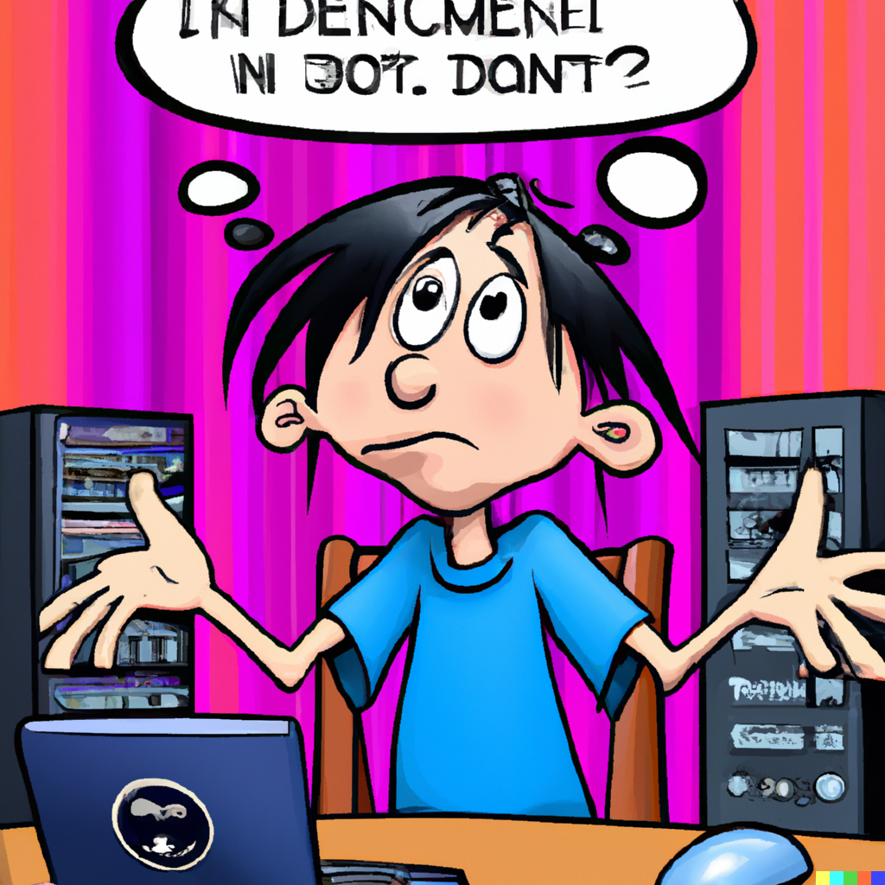

Hi everyone!

I'm Valentin, a passionate inventor using technology to make the world a better place.
I am on a [mission](../we-all-have-a-mission/) to increase both individual and collective intelligence, and to inspire and challenge you to think critically.
This blog will mix [thoughts](/tags/thoughts/), experiments, and ideas on a various topics, including [tech](/tags/tech/), design, and society.

I grew up with a natural curiosity and a desire to solve problems with my ideas and inventions.
This eventually led me to pursue an engineering degree in Communication Systems and now to work as a Product Manager for the company behind Ubuntu where I'm contributing to bringing free software to the widest audience.

One of my earliest experiences with the Internet was as a teenager, when I actually didn't have network access at home.
Though, I was determined to connect to the Internet. So I tried to remember and reproduce the IP and DNS configuration from the computers at school.
No need to say: it did't work!

Looking back, I'm grateful that I didn't have access to this powerful, unlimited resource too early in my life.
It gave me the time to be bored.
Boredom is essential to build creativity and a critical mind.

Anyway ; now, here I am writing to the world on the (real) Internet.
I truly hope my stories and ideas will inspire some of you.

Feel free to reach out to me on Twitter (you can find me at [@ValentinViennot](https://twitter.com/valentinviennot)) or via email ([blog@viennot.me](mailto:blog@viennot.me)) with any feedback or suggestions.

Wishing you a good read,
Valentin.

(DALL-E2 might be good at drawings, but not so much at writing texts.)