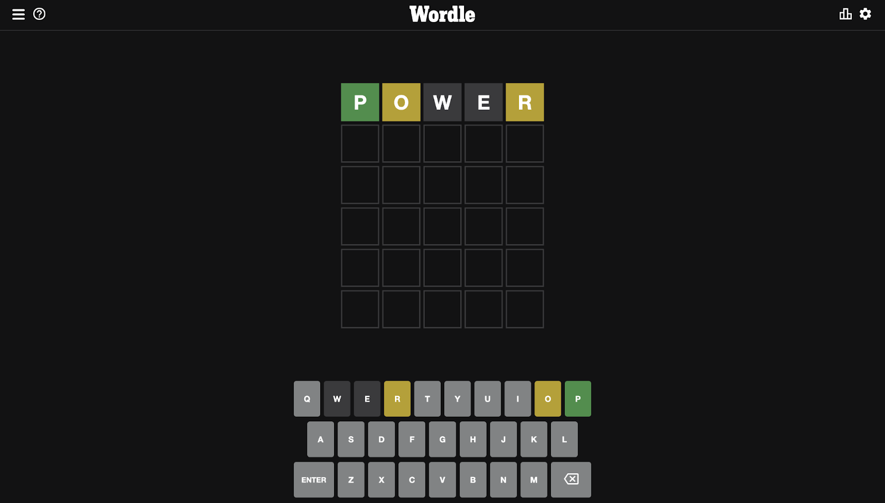
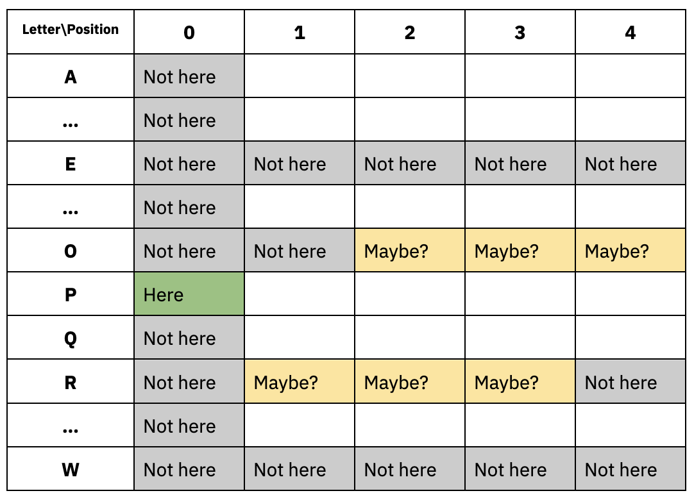
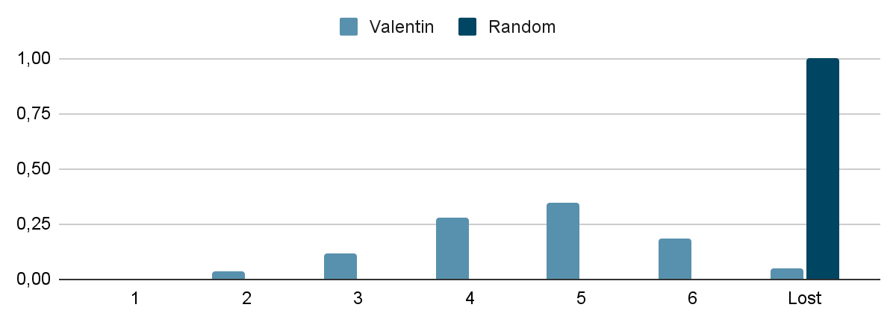
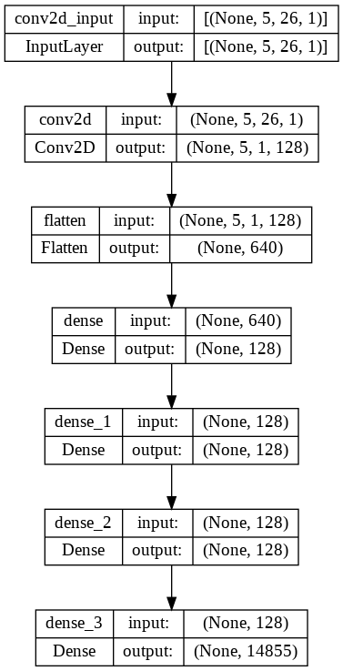
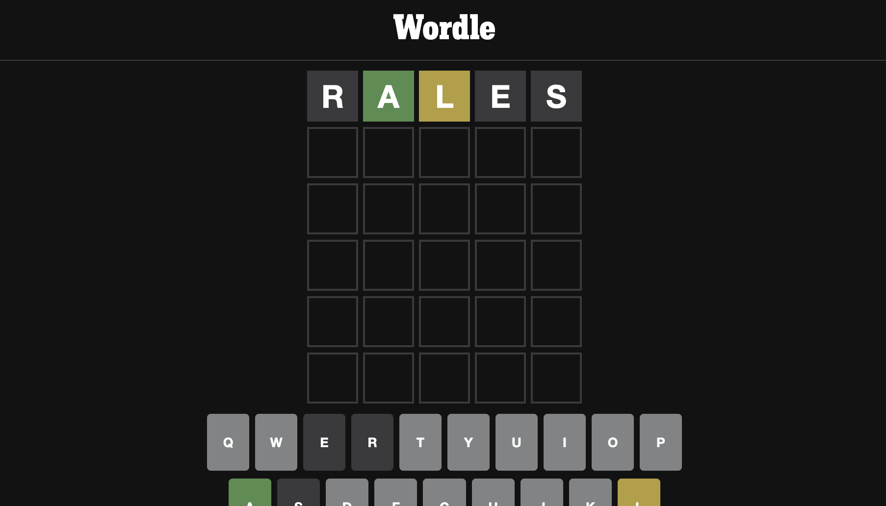
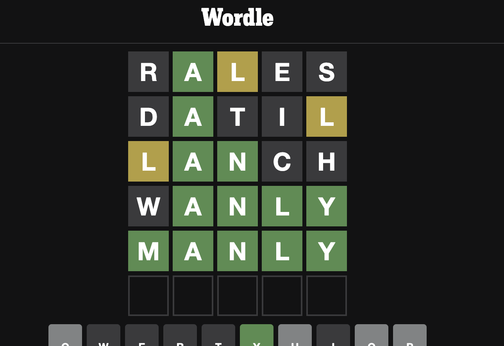

Are you a fan of Wordle, the addictive word puzzle game? Have you ever wondered what is the best word to play first? In this blog post, I'll explore the use of Convolutional Neural Networks (CNNs) to solve Wordle grids with a success rate of over 80%.

>  I should clarify that I'm not a data scientist – while I have a passion for machine learning and have completed a few courses on the subject, I am not an AI expert. My understanding of the topic is limited, and I only decided to use CNNs for this experiment because that's what I had learned in university. Please keep this in mind as you read through the post.

## What is the best word to play first in Wordle?

As the game gained popularity a year ago, my partner and I found ourselves playing regularly. At some point, I noticed that we were both always starting our grids using the same first word every day. He was using "Reals" and I was using "Power". To be fair I didn't really think about it, just some kind of habit. But I realised he had better stats than me, maybe thanks to his choice.

There surely is a right, scientific answer to the question of what is the best word to play first in Wordle. One approach to finding this word could be to conduct a statistical analysis of the English language, considering factors such as the most common letters and their likelihood of appearing at certain positions in a 5-letter word. Boooooring.

I remembered my Machine Learning classes and I thought that another, much more fun, way to go about it could be to teach a computer how to play Wordle, and observe. Maybe we could discover the secret to finding the best word to play first. There we go.

## Programming Wordle for Machine Learning

Computer programming is all about inputs and outputs (and one could argue that in an ideal world one would only use functional programming, but that will be another blog). What arguments do we pass to a function, and what results do we expect to see?

For our Wordle experiment, the output is clear: the daily Wordle word. But what about the input?

### Modelising the game: mental model

> Note: There are many ways to approach this problem. My approach was influenced by my own experience playing the game and my understanding of CNNs. CNNs are particularly good at manipulating images, and my way to visualise the ongoing Wordle grid state in Wordle was a kind of image in my mind.

On The New York Times [user interface](https://www.nytimes.com/games/wordle/index.html), the input is a keyboard with some kind of state. It shows letters you can use, words you already tried, and for each letter if it was (1) not in the word, (2) in the word but wrongly placed, (3) in the word and rightfully placed. It also validates what words you’re allowed to play.

Therefore, one way to represent this game state is as a matrix, with each position and letter representing the information we've learned about the word to be found. The matrix would have a 5x26 shape, on one axis the letter position (0-4) and on another axis the letter "code" (0-25). The value would tell us if the letter is (-2) not here for sure, (0) maybe here or nowhere, (1) somewhere in the word, or (2) here for sure.

This matrix is what I will adress as the "game state" in the following sections.

For each word we try, we can update the game state with the obtained information:

- GREEN: This letter is here (2), therefore no other letter can be here (-2).
- YELLOW: This letter might is somewhere (1), but we know for sure it’s not here (-2).
- NONE: This letter is nowhere in the word (-2).

Using this mental model, we can code the logic of the game in Python. The "Wordle helper functions" and "Dataset generation" in the accompanying [notebook](https://colab.research.google.com/drive/1w2sFNPswhem8JZFfDAX7JcFXg77YkWyX?usp=sharing) contain all the necessary source code and steps for training a computer to play Wordle.

Now that we have a way to represent the game state and a plan for programming the logic of the game, we can move on to building a Convolutional Neural Network (CNN) to solve Wordle grids.

## Convolutional Neural Networks: The Wordle Whisperers

A Convolutional Neural Network (CNN) is a type of artificial neural network specifically designed for image recognition tasks. It is made up of layers of interconnected nodes, where each node represents a unit of computation. CNN classifiers, which is what we are going to build here, take a matrice of pixels as their input (the image), have multiple hidden computation layers, and their output layer is a 1D-array of the possible classes.

In the context of our Wordle experiment, we can think of each game state as an image, with the position and letter representing different pixels. By training a CNN on a large dataset of game states and their corresponding correct words, we can teach the model to recognize patterns in the game states and make predictions about the correct word to play.

CNNs are particularly useful for our Wordle task as they are able to capture spatial relationships between pixels in an image. They not only consider one pixel but also its surroundings. In our case, not only one letter and its probabilities to be at this position, but also the surrounding letters and probabilities. This means that CNNs can learn to recognize patterns and features within the game states that might not be immediately apparent to a human observer.

### Generating the dataset

Before we can train our CNN to solve Wordle games, we need to have a dataset of possible game states and their corresponding correct words. In order to generate this dataset, we can use a simple player algorithm that iteratively plays random words from a dictionary, regardless of the game state. By saving the game state and the correct word for each iteration, we can build a large dataset of game states and their corresponding correct words.

To generate our dataset, we used a Wordle word list published [on GitHub](https://github.com/tabatkins/wordle-list). This list contains 14855 words, therefore a random player has a 1/14855 probability of guessing the correct word on each turn. Given that the player can't reuse a word, the probability of guessing the correct word on each subsequent turn decreases even further. But it's so low anyway that we can consider it a binomial distribution (X∼Bin(n,p)) with a success probability of about 0.0001.

Using the cumulative binomial probabilities, we find that a random player has a chance of success (P(X>=1, n=6)) of about 0.06%. One game out of 1,600. By playing a large number of games, we can generate a dataset with a good balance of correct and incorrect guesses.

In order to generate a human-quality dataset, we only saved a progressed game state and the correct word for each game (LOOP_TRAINING, MATURE_TRAINING). This is because the initial random game state contains no information (only zeros) and would introduce only noise into our dataset.

We iterated on over 3.7 million random games, resulting in about 370,000 correct guesses.

Generating this random training data can take a significant amount of time. In the linked Google [Colab notebook](https://colab.research.google.com/drive/1w2sFNPswhem8JZFfDAX7JcFXg77YkWyX?usp=sharing), I have saved the output of the cells so that you can look at the code without having to run the dataset generation yourself (took me about 25mn to generate all the data).

### Crafting the model

Now that we have our dataset, it's time to build the CNN model that will be used to solve Wordle games. In order to do this, we need to consider the shape of our input data (the game state) and the shape of our desired output (the correct word).

The input to our model is a matrix with 5 rows (corresponding to the 5 letters in the Wordle game) and 26 columns (corresponding to the 26 letters in the alphabet). The output of our model is a vector with 14855 elements, representing the "probabilities" of each word in our dictionary being the correct answer.

Our CNN model will have the following architecture:

The CNN architecture for solving Wordle consists of a simple 5x26 game input state as the first layer, followed by a 2D convolution layer which allows neighboring elements to influence each other. This helps the CNN to learn what game states "look like" a word or another one, similar to how humans can recognize whether a sequence of letters looks like a probable English word. The output of the convolution layer is then flattened and passed through dense layers to reduce its size and extract relevant information for classification. Finally, the model diverges to a 14855-element array representing the possible words.

### Training and evaluating the model

Now that we've crafted our CNN model, it's time to train it using the previously generated dataset. We'll use Google Colab for this process and iterate over 15 epochs.

While and after training the model, we'll need to be able to measure how well it performs in the real Wordle. To evaluate the performance of our model, we will use two metrics:

- **Accuracy**: This is a common metric for evaluating machine learning models. It represents the rate of correct output guesses given a test input. However, it's important to note that the accuracy of our model does not necessarily reflect its success at playing Wordle. This is because the input states used to calculate accuracy are already progressed (i.e., they are not completely random like when you start a Wordle game).

- **Winning rate**: To get a more accurate picture of our model's performance, we will also calculate the "winning rate" of our model. To do this, we will simulate a large number of Wordle games (using a 6-try, cumulative game state feedback loop) and compute the rate of won games over the total number of played games.

For comparison, a completely random player has a winning rate of about 0.06% (calculated using cumulative binomial probabilities, P(X≥1, n=6)). For a more challenging and exciting benchmark, according to the New York Times, my personal winning rate is 96%.

## Wordle Victory: CNNs Conquer the Game

I put our CNN model to the test and the results were not quite bad! After just 15 minutes of training on a GPU runtime, the model was ready to take on the Wordle. Here's what happened:

- Generating the necessary data for training and testing took me 25 minutes
- The actual training process took just 15 minutes, with 15 epochs on a GPU!
- Model's accuracy was a shy 79% – not so bad for a quick machine learning model!
- I put the model to the ultimate test by having it play 1000 random Wordle games. The winning rate? A pretty good 82% with just over 4 tries on average.

While it may not be able to beat human players just yet, our CNN model is definitely on the right track!

### So, What is The Best First Word to Play in Wordle?

One question remains: what is the best first word to play in Wordle?

The first word played by our model is "Rales". It appears to be accepted by Wordle, and to be an anagram of "Reals", which was a favorite first move of my partner and seemed to yield higher winning rates. Could it be that the key to Wordle success lies in the word "Rales"? Our CNN model seems to think so.

### BONUS: Quordle?

In the last cell of the Colab [notebook](https://colab.research.google.com/drive/1w2sFNPswhem8JZFfDAX7JcFXg77YkWyX?usp=sharing), I have demoed using the trained CNN to play the [Quordle](https://www.quordle.com/#/) variant of the Wordle game. As if playing Wordle wasn't challenging enough, in Quordle, players must juggle four Wordle games at once.

One of the main limitations of CNNs is their inability to consider tradeoffs such as "explore vs exploit" when making decisions. In games like Wordle and Quordle, players often have to weigh the benefits of exploring their options (e.g. playing a word that may not be the correct one but provides more information) against the potential rewards of exploiting their current knowledge (e.g. playing a word that they believe is the correct one).

There is a cool article on this topic, [using reinforcement learning to play Wordle](https://wandb.ai/andrewkho/wordle-solver/reports/Solving-Wordle-with-Reinforcement-Learning--VmlldzoxNTUzOTc4).

## Conclusion

This experiment demonstrated the potential of Convolutional Neural Networks (CNNs) for solving Wordle grids and potentially even surpassing human players. By training a CNN model on a dataset of random Wordle games, I was able to achieve a success rate of 82% when tested on 1000 games.

I hope that this blog post has provided an entertaining and informative look at the world of Wordle and machine learning. Whether you're a seasoned Wordle pro or a beginner, I hope that these insights will inspire you to think more critically when playing your next grid!

- [Google Colab Notebook](https://colab.research.google.com/drive/1w2sFNPswhem8JZFfDAX7JcFXg77YkWyX?usp=sharing)

